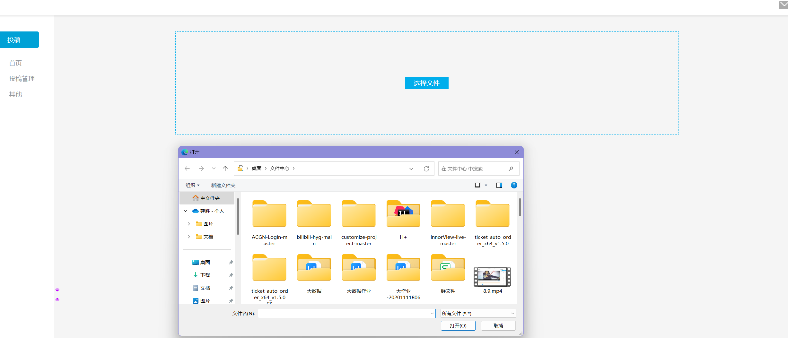

# 项目介绍
直播、点播弹幕系统，前端采用vue3,后端基于springboot
> 项目演示： https://www.bilibili.com/video/BV1Ur4y1o7Xs/?vd_source=ce062ba3efe2ccb8afe12b0078017476

> 后端地址：https://github.com/HuangJianSheng0822/ThreeDCloud
# 项目截图
## obs推流与fav.js拉流

## 首页，redis分页存储，热门视频的判定

## 视频上传与点播

